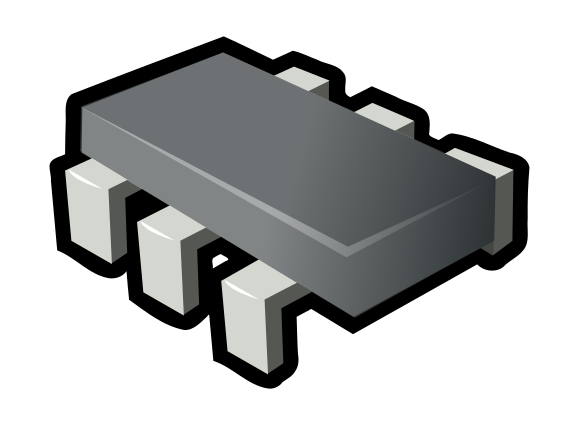

# PIC12F683 Drivers HAL Example Project

PIC12F683 Drivers HAL Example Project **(DRAFT)**

Wrote on MPLab X IDE v5.50
Compiled with Microchip XC8 v2.32

With this approach (HAL), this is the memory consumption after compiling:

Memory Summary:

    | Program space        used  19Eh (   414) of   800h words |  ( 20.2%) |
    | Data space           used   14h (    20) of    80h bytes |  ( 15.6%) |
    | EEPROM space         used    0h (     0) of   100h bytes |  (  0.0%) |
    | Configuration bits   used    1h (     1) of     1h word  |  (100.0%) |
    | ID Location space    used    0h (     0) of     4h bytes |  (  0.0%) |

Note: 
This is a work in progress.
The code has been written as a basis of the study of microcontrollers drivers.

Author: Eng. Jonnes Nascimento. 2021
